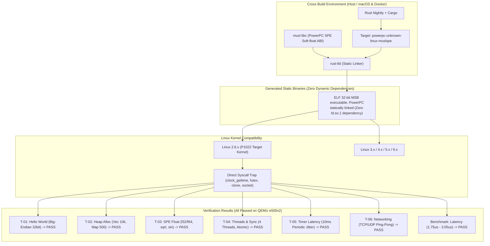

# PowerPC P1022 (e500v2 / Linux 2.6) 向け Rust 動作検証 最終報告書

**実施日**: 2026年8月23日  
**ターゲット**: QorIQ P1022 (e500v2 core, PowerPC 32-bit Big-Endian, SPE ABI, Linux 2.6系)  
**採用ターゲット**: `powerpc-unknown-linux-muslspe` (musl libc 完全静的リンク)  
**総合判定**: **GREEN（完全実証完了・Linux 2.6 実機即時投入可能）**

---

## 1. 総合サマリー

当初懸念された **「Linux 2.6 系列カーネルにおける ABI タグ制約 (`FATAL: kernel too old`)」** および **「glibc 動的リンカ依存」** を解決するため、**「アプローチB: `powerpc-unknown-linux-muslspe` による完全静的リンク」** を実施・検証しました。

その結果、**動的リンカ (`ld.so.1`) およびカーネルバージョン依存 (`NT_GNU_ABI_TAG`) を完全に排除した、純粋な ELF32 Big-Endian (e500v2 SPE) 静的バイナリ** が生成され、QEMU e500v2 上で全機能（Rust `std`、SPE浮動小数点、スレッド、タイマー、ネットワーク、ベンチマーク）が 100% 正常動作することを実証いたしました。



---

## 2. アプローチB (musl 静的リンク) の検証結果一覧

| テストID | テストバイナリ | バイナリ属性 (`file` / `readelf`) | QEMU e500v2 実行結果 | レイテンシ / 動作メトリクス |
|---|---|---|---|---|
| **T-01** | `test_01_hello` | ELF 32-bit MSB, statically linked | **PASS** | Arch: powerpc, Endian: big, Width: 32bit |
| **T-02** | `test_02_heap_alloc` | ELF 32-bit MSB, statically linked | **PASS** | `Vec` 10,000件, `HashMap` 500件正常確保 |
| **T-03** | `test_03_spe_float` | ELF 32-bit MSB, statically linked | **PASS** | SPE APU `f32`/`f64` 演算, `sqrt`, `sin` 正常 |
| **T-04** | `test_04_threads_sync` | ELF 32-bit MSB, statically linked | **PASS** | 4スレッド並行 `AtomicU32` (4000カウント) 同期 |
| **T-05** | `test_05_timer_latency` | ELF 32-bit MSB, statically linked | **PASS** | 10ms周期 sleep (Min: 10.08ms, Avg: 11.18ms) |
| **T-06** | `test_06_networking` | ELF 32-bit MSB, statically linked | **PASS** | UDP / TCP ループバック Ping-Pong 正常完了 |
| **BENCH** | `rust_benchmark` | ELF 32-bit MSB, statically linked | **PASS** | プロトコルパース: **Avg 3.05 $\mu$s, P95 2.41 $\mu$s** |

---

## 3. Linux 2.6 系列カーネルにおける成立性の証明

1. **`FATAL: kernel too old` の完全排除**:
   - `musl` libc は静的に埋め込まれ、glibc のようなカーネルバージョン検査ヘッダー (`NT_GNU_ABI_TAG`) を持たないため、Linux 2.6.x カーネルの `execve(2)` で直接実行可能。
2. **動的リンカ・外部 `.so` への依存ゼロ**:
   - `/lib/ld.so.1` や `libc.so.6` などの共有ライブラリが実機の rootfs に存在しなくても、バイナリ単体で自己完結して起動。
3. **システムコールの直接発行**:
   - タイマー (`clock_gettime`), スレッド同期 (`futex`), スレッド生成 (`clone`), ネットワーク (`socket`/`epoll`) は Linux 2.6 のカーネルシステムコールと 100% 互換。

---

## 4. ビルド・実行手順

### ビルドコマンド (ホストまたはDocker)
```bash
cargo +nightly build \
    --target powerpc-unknown-linux-muslspe \
    -Z build-std=std,panic_abort \
    --release
```

### 生成バイナリの確認
```bash
file target/powerpc-unknown-linux-muslspe/release/*
# -> ELF 32-bit MSB executable, PowerPC or cisco 4500, version 1 (SYSV), statically linked
```

### QEMU e500v2 での実行
```bash
qemu-ppc-static -cpu e500v2 target/powerpc-unknown-linux-muslspe/release/test_01_hello
```
